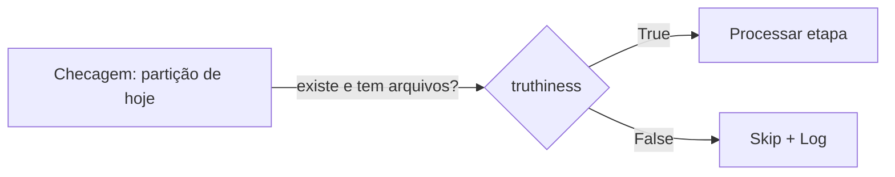
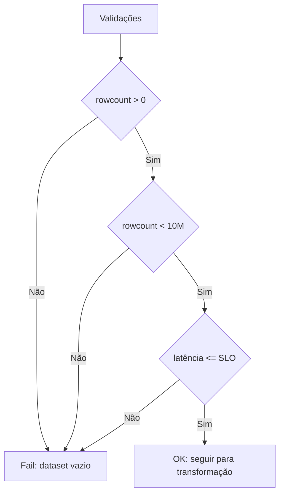
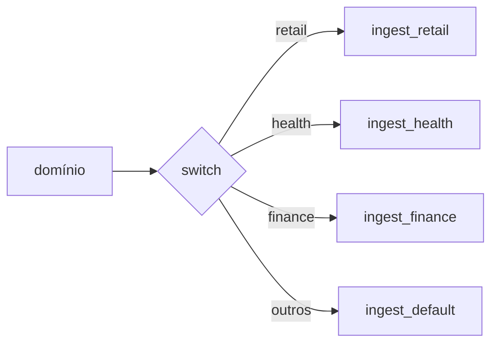
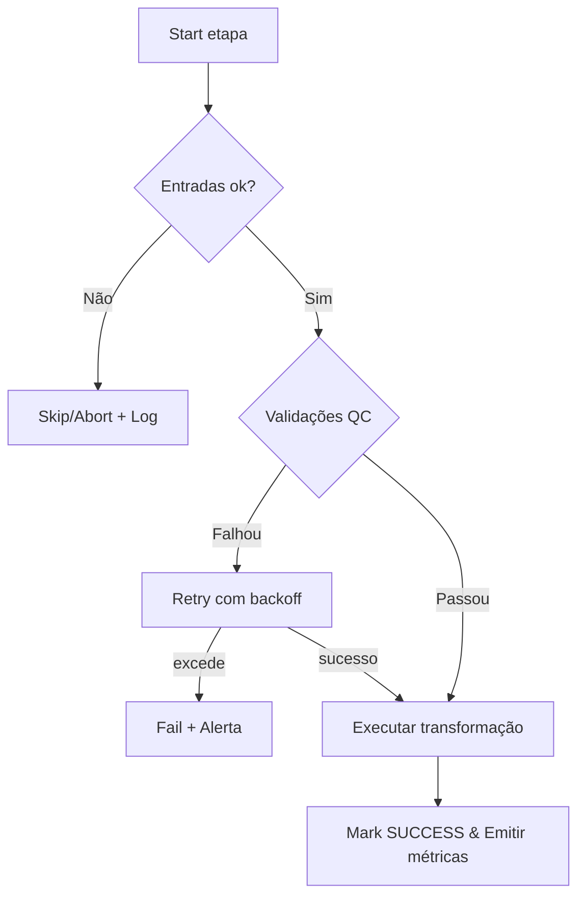

# Condições em Python aplicadas à Engenharia de Dados
Como decidir se **uma etapa/pipeline é “sim (rodar/seguir)” ou “não (falhar/abortar)”**? A resposta nasce de **expressões condicionais** bem definidas, que transformam métricas e sinais do pipeline em `True`/`False` de forma previsível e testável.

> Regra de ouro: toda etapa deve expor um **critério claro de sucesso** (ex.: *validação de schema passou, linhas > 0, SLA ok*) e um **comportamento para falha** (retry, skip, alertar, abortar).

---

## 1) Expressões atômicas (truthiness)
> “Atômica” = um único objeto avaliado como verdadeiro/falso.  
Em Python, valores **vazios** ou **nulos** são `False`: `''`, `0`, `[]`, `{}`, `set()`, `None`. O resto tende a ser `True`.

**Na prática (DE):** habilitar/pausar uma etapa com base na presença de variável de ambiente, caminho, partição ou dataframe vazio.

```python
if df:              # df não vazio
    carregar(df)
else:
    logger.warning("Nada para processar; etapa será ignorada.")
```



---

## 2) Comparação rica
> Comparações entre dois objetos: `==`, `!=`, `<`, `>`, `<=`, `>=`, `in`, `not in`, `is`, `is not`.  
Python permite **encadeamento**: `a < b < c`.

**Na prática (DE):** gates por **quantidade de linhas**, **datas/horários**, **latência**, **uso de CPU/memória**, **versão de schema**.

```python
if 0 < rowcount < 10_000_000 and latency_ms <= SLO_MS:
    aprovar_validação()
```



---

## 3) Operadores booleanos (`and`, `or`, `not`) e curto‑circuito
> Combine condições; Python **curto-circuita** (para de avaliar quando o resultado já é definido).  
Use também `any()`/`all()` para listas de checagens.

**Na prática (DE):** só roda se **todas** as pré‑condições forem verdadeiras (inputs ok, credenciais, feature flag) *e* **nenhuma** restrição estiver ativa (janela de manutenção).

```python
pre_ok = all([tem_input, cred_ok, schema_ok])
bloqueios = any([janela_manutencao, quota_estourada])

if pre_ok and not bloqueios:
    run()
else:
    abrir_incidente()
```

```mermaid
flowchart LR
    A[Pré-checks] --> B{all(OKs)}
    A2[Bloqueios] --> C{any(Erros)}
    B -- True --> D{not C}
    B -- False --> X[Abortar]
    D -- True --> RUN[Executar]
    D -- False --> X
```

---

## 4) Atribuição em expressão (`:=`, o “walrus”)
> Permite **avaliar e guardar** o resultado no mesmo `if/while`.

**Na prática (DE):** leitura em **lotes** (paginação), captura de retorno de validação, cálculo incremental.

```python
while (lote := ler_proximas_linhas(batch=100_000)):
    processar(lote)
```

```mermaid
flowchart TD
    I[Início] --> W{(lote := next_batch())}
    W -- Tem dados --> P[Processar lote]
    P --> W
    W -- Vazio/None --> F[Fim]
```

---

## 5) `if / elif / else` — sem pirâmide do caos
> `elif` é útil, mas **muitos desvios criam complexidade de teste**. Prefira **guard clauses** (retornos antecipados), **dicionários de estratégia** ou `match/case` quando fizer sentido.

**Na prática (DE):** rotear ingestão por **domínio/fonte**, escolhendo conector e formatação corretos sem uma torre de `elif`.

```python
estrategias = {
    "retail": ingest_retail,
    "health": ingest_health,
    "finance": ingest_finance,
}
(estrategias.get(dominio) or ingest_default)(payload)
```



---

## 6) Pipeline “sim ou não”: critério de sucesso e observabilidade
> No final, todo pipeline precisa responder **de forma binária**: **passou** ou **falhou**.  
Implemente **validações**, **retries**, **timeouts**, **alertas** e **marcação de estado** (ex.: `SUCCESS`, `FAILED`, `SKIPPED`).

**Checklist rápido**
- ✅ **Critérios de entrada** claros (inputs, partições, schema).  
- ✅ **Validações** de integridade/qualidade (contagem, nulls, PK, FK, ranges, regras de negócio).  
- ✅ **Tratamento de erro**: `retry` com backoff, `circuit breaker`, `skip` quando apropriado.  
- ✅ **SLO/SLA**: latência, janelas, custos.  
- ✅ **Sinais**: métricas, logs estruturados, eventos, alertas.  
- ✅ **Saída idempotente** e **commit único**.

```python
try:
    assert entradas_ok() and validacao_qc()
    executar_etapa()
    marcar_sucesso()
except Exception as e:
    registrar_erro(e); agendar_retry(); alertar_oncall()
```



---

### Dicas finais (DE)
- **Faça as condições falarem negócio**: “linhas válidas ≥ 95%”, “latência ≤ 2m” etc.  
- **Evite aninhar** `if` profundamente — use *guards* e estratégias.  
- **Teste as condições** com dados sintéticos e *feature flags* para ligar/desligar caminhos.  
- **Observabilidade** primeiro: sem medida, não há *sim/não* confiável.
