```mermaid
flowchart LR
    A[Checagem: partição de hoje] -->|existe e tem arquivos?| B{truthiness}
    B -- True --> C[Processar etapa]
    B -- False --> D[Skip + Log]
```

```mermaid
flowchart TD
    S[Validações] --> A{rowcount > 0}
    A -- Não --> F[Fail: dataset vazio]
    A -- Sim --> B{rowcount < 10M}
    B -- Não --> F
    B -- Sim --> C{latência <= SLO}
    C -- Não --> F
    C -- Sim --> OK[OK: seguir para transformação]
```

```mermaid
flowchart LR
    A[domínio] --> B{switch}
    B -->|retail| R[ingest_retail]
    B -->|health| H[ingest_health]
    B -->|finance| F[ingest_finance]
    B -->|outros| D[ingest_default]
```

```mermaid
flowchart TD
    A[Start etapa] --> E{Entradas ok?}
    E -- Não --> S[Skip/Abort + Log]
    E -- Sim --> V{Validações QC}
    V -- Falhou --> R[Retry com backoff]
    R -->|excede| F[Fail + Alerta]
    R -->|sucesso| X[Continuar]
    V -- Passou --> X[Executar transformação]
    X --> O[Mark SUCCESS & Emitir métricas]
```

# Condições em Python aplicadas à Engenharia de Dados

Como decidir se **uma etapa/pipeline é “sim (rodar/seguir)” ou “não (falhar/abortar)”**? A resposta nasce de **expressões condicionais** bem definidas, que transformam métricas e sinais do pipeline em `True`/`False` de forma previsível e testável.

> Regra de ouro: toda etapa deve expor um **critério claro de sucesso** (ex.: *validação de schema passou, linhas > 0, SLA ok*) e um **comportamento para falha** (retry, skip, alertar, abortar).


---

## 1) Expressões atômicas (truthiness)
> “Atômica” = um único objeto avaliado como verdadeiro/falso.  
Em Python, valores **vazios** ou **nulos** são `False`: `''`, `0`, `[]`, `{}`, `set()`, `None`. O resto tende a ser `True`.

**Na prática (DE):** habilitar/pausar uma etapa com base na presença de variável de ambiente, caminho, partição ou dataframe vazio.

```python
if df:              # df não vazio
    carregar(df)
else:
    logger.warning("Nada para processar; etapa será ignorada.")
```



---

## 2) Comparação rica
> Comparações entre dois objetos: `==`, `!=`, `<`, `>`, `<=`, `>=`, `in`, `not in`, `is`, `is not`.  
Python permite **encadeamento**: `a < b < c`.

**Na prática (DE):** gates por **quantidade de linhas**, **datas/horários**, **latência**, **uso de CPU/memória**, **versão de schema**.

```python
if 0 < rowcount < 10_000_000 and latency_ms <= SLO_MS:
    aprovar_validação()
```



---

## 3) Operadores booleanos (`and`, `or`, `not`) e curto‑circuito
> Combine condições; Python **curto-circuita** (para de avaliar quando o resultado já é definido).  
Use também `any()`/`all()` para listas de checagens.

**Na prática (DE):** só roda se **todas** as pré‑condições forem verdadeiras (inputs ok, credenciais, feature flag) *e* **nenhuma** restrição estiver ativa (janela de manutenção).

```python
pre_ok = all([tem_input, cred_ok, schema_ok])
bloqueios = any([janela_manutencao, quota_estourada])

if pre_ok and not bloqueios:
    run()
else:
    abrir_incidente()
```

```mermaid
flowchart LR
    A[Pré-checks] --> B{all(OKs)}
    A2[Bloqueios] --> C{any(Erros)}
    B -- True --> D{not C}
    B -- False --> X[Abortar]
    D -- True --> RUN[Executar]
    D -- False --> X
```

---

## 4) Atribuição em expressão (`:=`, o “walrus”)
> Permite **avaliar e guardar** o resultado no mesmo `if/while`.

**Na prática (DE):** leitura em **lotes** (paginação), captura de retorno de validação, cálculo incremental.

```python
while (lote := ler_proximas_linhas(batch=100_000)):
    processar(lote)
```

```mermaid
flowchart TD
    I[Início] --> W{(lote := next_batch())}
    W -- Tem dados --> P[Processar lote]
    P --> W
    W -- Vazio/None --> F[Fim]
```

---

## 5) `if / elif / else` — sem pirâmide do caos
> `elif` é útil, mas **muitos desvios criam complexidade de teste**. Prefira **guard clauses** (retornos antecipados), **dicionários de estratégia** ou `match/case` quando fizer sentido.

**Na prática (DE):** rotear ingestão por **domínio/fonte**, escolhendo conector e formatação corretos sem uma torre de `elif`.

```python
estrategias = {
    "retail": ingest_retail,
    "health": ingest_health,
    "finance": ingest_finance,
}
(estrategias.get(dominio) or ingest_default)(payload)
```



---

## 6) Pipeline “sim ou não”: critério de sucesso e observabilidade
> No final, todo pipeline precisa responder **de forma binária**: **passou** ou **falhou**.  
Implemente **validações**, **retries**, **timeouts**, **alertas** e **marcação de estado** (ex.: `SUCCESS`, `FAILED`, `SKIPPED`).

**Checklist rápido**
- ✅ **Critérios de entrada** claros (inputs, partições, schema).  
- ✅ **Validações** de integridade/qualidade (contagem, nulls, PK, FK, ranges, regras de negócio).  
- ✅ **Tratamento de erro**: `retry` com backoff, `circuit breaker`, `skip` quando apropriado.  
- ✅ **SLO/SLA**: latência, janelas, custos.  
- ✅ **Sinais**: métricas, logs estruturados, eventos, alertas.  
- ✅ **Saída idempotente** e **commit único**.

```python
try:
    assert entradas_ok() and validacao_qc()
    executar_etapa()
    marcar_sucesso()
except Exception as e:
    registrar_erro(e); agendar_retry(); alertar_oncall()
```



---

### Dicas finais (DE)
- **Faça as condições falarem negócio**: “linhas válidas ≥ 95%”, “latência ≤ 2m” etc.  
- **Evite aninhar** `if` profundamente — use *guards* e estratégias.  
- **Teste as condições** com dados sintéticos e *feature flags* para ligar/desligar caminhos.  
- **Observabilidade** primeiro: sem medida, não há *sim/não* confiável.
# Condições em Python aplicadas à Engenharia de Dados


Como decidir se **uma etapa/pipeline é “sim (rodar/seguir)” ou “não (falhar/abortar)”**? A resposta nasce de **expressões condicionais** bem definidas, que transformam métricas e sinais do pipeline em `True`/`False` de forma previsível e testável.

> Regra de ouro: toda etapa deve expor um **critério claro de sucesso** (ex.: *validação de schema passou, linhas > 0, SLA ok*) e um **comportamento para falha** (retry, skip, alertar, abortar).


---

## 1) Expressões atômicas (truthiness)
> “Atômica” = um único objeto avaliado como verdadeiro/falso.  
Em Python, valores **vazios** ou **nulos** são `False`: `''`, `0`, `[]`, `{}`, `set()`, `None`. O resto tende a ser `True`.

**Na prática (DE):** habilitar/pausar uma etapa com base na presença de variável de ambiente, caminho, partição ou dataframe vazio.

```python
if df:              # df não vazio
    carregar(df)
else:
    logger.warning("Nada para processar; etapa será ignorada.")
```


---

## 2) Comparação rica
> Comparações entre dois objetos: `==`, `!=`, `<`, `>`, `<=`, `>=`, `in`, `not in`, `is`, `is not`.  
Python permite **encadeamento**: `a < b < c`.

**Na prática (DE):** gates por **quantidade de linhas**, **datas/horários**, **latência**, **uso de CPU/memória**, **versão de schema**.

```python
if 0 < rowcount < 10_000_000 and latency_ms <= SLO_MS:
    aprovar_validação()
```


---

## 3) Operadores booleanos (`and`, `or`, `not`) e curto‑circuito
> Combine condições; Python **curto-circuita** (para de avaliar quando o resultado já é definido).  
Use também `any()`/`all()` para listas de checagens.

**Na prática (DE):** só roda se **todas** as pré‑condições forem verdadeiras (inputs ok, credenciais, feature flag) *e* **nenhuma** restrição estiver ativa (janela de manutenção).

```python
pre_ok = all([tem_input, cred_ok, schema_ok])
bloqueios = any([janela_manutencao, quota_estourada])

if pre_ok and not bloqueios:
    run()
else:
    abrir_incidente()
```

```mermaid
flowchart LR
    A[Pré-checks] --> B{all(OKs)}
    A2[Bloqueios] --> C{any(Erros)}
    B -- True --> D{not C}
    B -- False --> X[Abortar]
    D -- True --> RUN[Executar]
    D -- False --> X
```

---

## 4) Atribuição em expressão (`:=`, o “walrus”)
> Permite **avaliar e guardar** o resultado no mesmo `if/while`.

**Na prática (DE):** leitura em **lotes** (paginação), captura de retorno de validação, cálculo incremental.

```python
while (lote := ler_proximas_linhas(batch=100_000)):
    processar(lote)
```

```mermaid
flowchart TD
    I[Início] --> W{(lote := next_batch())}
    W -- Tem dados --> P[Processar lote]
    P --> W
    W -- Vazio/None --> F[Fim]
```

---

## 5) `if / elif / else` — sem pirâmide do caos
> `elif` é útil, mas **muitos desvios criam complexidade de teste**. Prefira **guard clauses** (retornos antecipados), **dicionários de estratégia** ou `match/case` quando fizer sentido.

**Na prática (DE):** rotear ingestão por **domínio/fonte**, escolhendo conector e formatação corretos sem uma torre de `elif`.

```python
estrategias = {
    "retail": ingest_retail,
    "health": ingest_health,
    "finance": ingest_finance,
}
(estrategias.get(dominio) or ingest_default)(payload)
```


---

## 6) Pipeline “sim ou não”: critério de sucesso e observabilidade
> No final, todo pipeline precisa responder **de forma binária**: **passou** ou **falhou**.  
Implemente **validações**, **retries**, **timeouts**, **alertas** e **marcação de estado** (ex.: `SUCCESS`, `FAILED`, `SKIPPED`).

**Checklist rápido**
- ✅ **Critérios de entrada** claros (inputs, partições, schema).  
- ✅ **Validações** de integridade/qualidade (contagem, nulls, PK, FK, ranges, regras de negócio).  
- ✅ **Tratamento de erro**: `retry` com backoff, `circuit breaker`, `skip` quando apropriado.  
- ✅ **SLO/SLA**: latência, janelas, custos.  
- ✅ **Sinais**: métricas, logs estruturados, eventos, alertas.  
- ✅ **Saída idempotente** e **commit único**.

```python
try:
    assert entradas_ok() and validacao_qc()
    executar_etapa()
    marcar_sucesso()
except Exception as e:
    registrar_erro(e); agendar_retry(); alertar_oncall()
```


---

### Dicas finais (DE)
- **Faça as condições falarem negócio**: “linhas válidas ≥ 95%”, “latência ≤ 2m” etc.  
- **Evite aninhar** `if` profundamente — use *guards* e estratégias.  
- **Teste as condições** com dados sintéticos e *feature flags* para ligar/desligar caminhos.  
- **Observabilidade** primeiro: sem medida, não há *sim/não* confiável.

---

## 🚀 Plano de Execução

Este projeto demonstra conceitos de **controle de fluxo** aplicados à Engenharia de Dados através de exemplos práticos e exercícios.

### 📋 Pré-requisitos

- **Python 3.13+** (gerenciado via `uv`)
- **uv** instalado ([instruções de instalação](https://docs.astral.sh/uv/getting-started/installation/))

### 🔧 Configuração do Ambiente

1. **Clone o repositório**
   ```bash
   git clone <url-do-repositorio>
   cd controle_de_fluxo_engenharia_de_dados
   ```

2. **Instale as dependências**
   ```bash
   uv sync
   ```

3. **Verifique a instalação**
   ```bash
   uv run python --version
   ```

### 🎯 Executando o Projeto

#### Execução Básica
```bash
uv run python main.py
```

#### Modo Interativo (para experimentos)
```bash
uv run python
```

#### Execução com Debug
```bash
uv run python -v main.py
```

### 📚 Estrutura de Aprendizado

O projeto está organizado para demonstrar progressivamente:

1. **Expressões Atômicas** - Truthiness básico
2. **Comparações Ricas** - Operadores de comparação
3. **Operadores Booleanos** - Lógica combinada
4. **Atribuição em Expressão** - Walrus operator
5. **Estruturas Condicionais** - if/elif/else
6. **Pipelines de Dados** - Controle de fluxo em ETL

### 🧪 Exercícios Práticos

Para cada conceito, experimente:

1. **Modifique o `main.py`** com seus próprios exemplos
2. **Teste diferentes cenários** de dados
3. **Implemente validações** de pipeline
4. **Adicione logging** para observabilidade

### 🔍 Exemplos de Uso

#### Validação de Dataset
```python
# Exemplo: validar se dataset está pronto para processamento
def validar_dataset(df):
    return (
        df is not None and
        len(df) > 0 and
        not df.empty and
        df.columns.isin(['id', 'nome', 'data']).all()
    )
```

#### Controle de Pipeline
```python
# Exemplo: gate de execução baseado em condições
def executar_etapa_se_ok():
    if (tem_dados := verificar_particao()) and not em_manutencao():
        processar_dados()
        return True
    return False
```

### 📊 Monitoramento e Observabilidade

- **Logs estruturados** para cada decisão
- **Métricas** de sucesso/falha
- **Alertas** para condições críticas
- **Retry logic** com backoff exponencial

### 🛠️ Desenvolvimento

#### Adicionando Novas Dependências
```bash
uv add nome-do-pacote
```

#### Executando Testes (quando implementados)
```bash
uv run pytest
```

#### Formatação de Código
```bash
uv run black .
uv run isort .
```

### 📈 Próximos Passos

1. **Implementar exemplos práticos** de cada conceito
2. **Adicionar testes unitários** para validações
3. **Criar cenários de pipeline** realistas
4. **Documentar padrões** de controle de fluxo
5. **Adicionar métricas** e observabilidade

---

## 📞 Suporte

Para dúvidas ou sugestões sobre controle de fluxo em pipelines de dados, abra uma issue no repositório.
